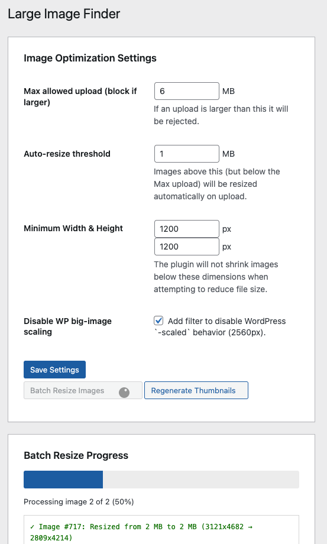
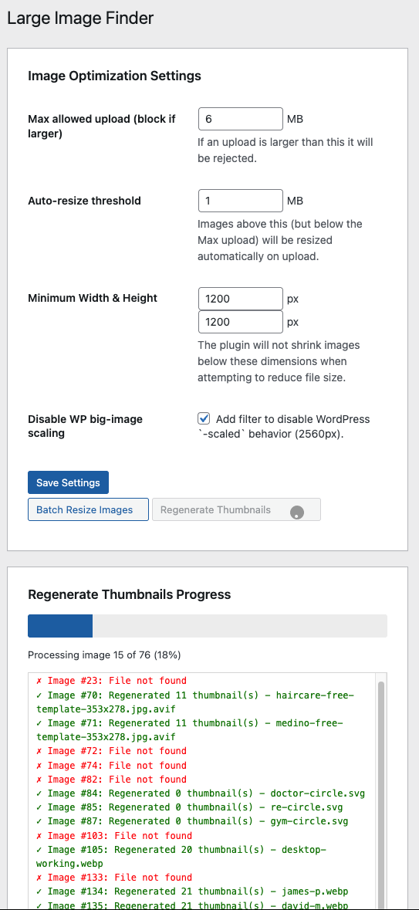

# WP Optimiser by SimpliWeb

A comprehensive WordPress optimisation toolkit that helps you analyse, clean up, and maintain your WordPress site with five powerful features.

## Features

### 1. Post Relationship Visualiser
Analyse your site's internal linking structure to improve SEO and content discoverability.

- Scans all posts, pages, and custom post types
- Identifies orphaned content (posts with no incoming links)
- Shows top 20 most connected posts
- Displays "Links To" and "Linked By" counts
- One-click access to edit posts

### 2. Transient Manager
View and manage WordPress transients to optimise database performance.

- Lists up to 500 transients with details
- Shows expiration date and status for each transient
- Displays individual and total size information
- Delete expired transients with one click
- Delete all transients when needed (with confirmation)
- Free up database space quickly

### 3. Shortcode Finder
Scan all content to find and verify shortcodes before they break.

- Finds all shortcodes used across your site
- Identifies registered vs orphaned (broken) shortcodes
- Shows usage count per shortcode
- Lists all posts using each shortcode
- Essential before deactivating plugins
- Displays all currently registered shortcodes

### 4. Media Library Source Tracker
Automatically track where media files are uploaded from.

- Tracks upload source automatically (no configuration needed)
- Adds "Upload Source" column to Media Library
- Shows which post/page the media was uploaded from
- Displays source post type
- Shows last 200 uploads with tracking data
- Helps identify and clean up unused media

### 5. Image Optimisation & Management
Comprehensive image optimisation tools to reduce file sizes and manage your media library.

#### Image Optimisation Settings
- **Max Allowed Upload**: Block uploads larger than specified size (default: 6 MB)
- **Auto-Resize Threshold**: Automatically resize images above this size on upload (default: 1 MB)
- **Minimum Dimensions**: Set minimum width/height to prevent over-compression (default: 1200×1200px)
- **Disable WordPress Scaling**: Remove WordPress's automatic 2560px `-scaled` image generation
- **Automatic Cleanup**: When disabling scaled images, automatically removes existing `-scaled` files and updates database references

#### Batch Operations (AJAX-powered with progress tracking)
- **Batch Resize Images**: Process all existing images above the auto-resize threshold
  - Real-time progress bar and detailed logging
  - Maintains aspect ratio and respects minimum dimensions
  - Updates thumbnails after resizing
  - Shows before/after file sizes
- **Regenerate Thumbnails**: Rebuild all image thumbnails site-wide
  - Deletes old thumbnails before regenerating
  - Updates image metadata
  - Shows count of thumbnails generated per image

#### Large Image Finder
- Search for images by minimum file size (KB/MB/GB)
- Paginated results (20 per page)
- Displays for each image:
  - Preview thumbnail
  - File name and dimensions
  - File size (highlighted in red)
  - Alt text and description
  - Attached post/page
  - Upload date
- Quick edit access for each image
- Total size calculation
- Optimisation tips and recommendations

#### Automatic Features
- **Upload Size Enforcement**: Blocks images exceeding maximum upload size with clear error message
- **Smart Auto-Resize**: Resizes large uploads automatically while respecting minimum dimensions
- **Quality Control**: Uses 82% JPEG quality (WordPress default) for optimal size/quality balance
- **Thumbnail Generation**: Registers `simpli-thumbnail` size (50×50px) for plugin interface

## Screenshots

### Posts Relationships

### Transient Manager

### Shortcode Finder

### Media Library Source Tracker

### Image Optimisation Settings

### Batch Resize Progress

### Regenerate Thumbnails Progress

## Installation

### Method 1: Upload via WordPress Admin

1. Download the plugin folder
2. Create a zip file of the `simpliweb-wp-optimiser` folder
3. In WordPress admin, go to **Plugins > Add New > Upload Plugin**
4. Choose the zip file and click **Install Now**
5. Click **Activate Plugin**

### Method 2: Manual FTP Upload

1. Download the plugin folder
2. Upload the entire `simpliweb-wp-optimiser` folder to `/wp-content/plugins/`
3. Go to **Plugins** in WordPress admin
4. Find "WP Optimiser by SimpliWeb" and click **Activate**

## Usage

### Accessing the Plugin

After activation, find the **Optimiser** menu item (with hammer icon) in your WordPress admin sidebar.

### Post Relationships

1. Navigate to **Optimiser > Post Relationships**
2. Click **Scan Relationships** button
3. Wait for the scan to complete (may take 30-60 seconds on large sites)
4. Review the results:
   - Total posts scanned
   - Posts with outgoing links
   - Orphaned posts list
   - Link map of top 20 most connected posts
5. Click **Edit** on any post to improve internal linking

### Transient Manager

1. Navigate to **Optimiser > Transient Manager**
2. View transient statistics and list
3. Options:
   - **Delete Expired Transients** - Removes only expired entries (recommended)
   - **Delete All Transients** - Clears all transients (may temporarily slow your site)
4. Refresh the page to see updated statistics

### Shortcode Finder

1. Navigate to **Optimiser > Shortcode Finder**
2. View automatically generated report showing:
   - Total unique shortcodes found
   - Orphaned shortcodes (not registered)
   - Posts with shortcodes
3. Check the status column (✓ Registered or ✗ Not Registered)
4. Expand details to see which posts use each shortcode
5. Fix or remove broken shortcodes before users see them

### Media Library Source Tracker

This feature works automatically once activated.

1. Navigate to **Optimiser > Media Library Source Tracker** to view tracking report
2. Or go to **Media > Library** to see the new "Upload Source" column
3. Upload images as normal - source is tracked automatically
4. View statistics on tracked vs untracked uploads

### Image Optimisation & Management

#### Configure Settings

1. Navigate to **Optimiser > Image Optimisation**
2. Configure your optimisation settings:
   - **Max Allowed Upload**: Set maximum file size (blocks uploads if exceeded)
   - **Auto-Resize Threshold**: Images above this will be automatically resized
   - **Minimum Dimensions**: Prevent images from being resized too small
   - **Disable WP Scaling**: Check to prevent WordPress from creating `-scaled` versions
3. Click **Save Settings**

#### Batch Resize Existing Images

1. Navigate to **Optimiser > Image Optimisation**
2. Click **Batch Resize Images** button
3. Confirm the action (recommended: backup first)
4. Watch the progress bar and log:
   - Shows current image being processed
   - Displays before/after file sizes
   - Reports any errors
5. Wait for completion (may take several minutes on large sites)

#### Regenerate Thumbnails

1. Navigate to **Optimiser > Image Optimisation**
2. Click **Regenerate Thumbnails** button
3. Confirm the action
4. Monitor progress as all thumbnails are regenerated
5. Useful after:
   - Changing theme
   - Adding new image sizes
   - Fixing corrupted thumbnails

#### Find Large Images

1. Navigate to **Optimiser > Image Optimisation**
2. Scroll to "Search for Large Images"
3. Enter minimum file size and select unit (KB/MB/GB)
4. Click **Find Large Images**
5. Review results:
   - Total images found and combined size
   - Image details with preview thumbnails
   - Quick access to edit each image
6. Use pagination if more than 20 results

#### Automatic Upload Optimisation

This works automatically for all new uploads:
- Images exceeding max upload size are blocked with error message
- Images above auto-resize threshold are automatically resized
- Dimensions respect your minimum width/height settings
- Upload source is tracked for reference
- No manual action required

## Requirements

- WordPress 5.0 or higher
- PHP 7.2 or higher
- Administrator user role
- PHP GD or Imagick extension (for image processing)

## Performance Notes

- **Post Relationship Visualiser**: May take 30-60 seconds on large sites (1000+ posts). Uses AJAX to prevent timeouts.
- **Transient Manager**: Instant deletion. Site may be slightly slower after clearing all transients as they rebuild.
- **Shortcode Finder**: Queries database once per page load. Results are always current (not cached).
- **Media Library Source Tracker**: Minimal performance impact. Only fires on upload.
- **Image Optimisation**: 
  - Auto-resize on upload adds 1-2 seconds per image
  - Batch operations use AJAX to prevent timeouts
  - Processing speed depends on image count and server resources
  - Recommended to run batch operations during low-traffic periods

## Database Storage

The plugin stores minimal data:
- Media source tracking uses postmeta: `_upload_source_post`, `_upload_source_url`, `_upload_date`
- Image optimisation settings stored in wp_options:
  - `simpli_max_upload_bytes`
  - `simpli_resize_bytes`
  - `simpli_min_width`
  - `simpli_min_height`
  - `simpli_disable_scaled`
- No custom database tables are created

## Security

All features include:
- `manage_options` capability requirement (Administrator only)
- WordPress nonce verification for CSRF protection
- Proper output escaping
- Prepared statements for database queries
- Permission checks on all AJAX requests
- File type validation for image operations

## Frequently Asked Questions

### Why are some posts showing as orphaned?

Orphaned posts have no incoming internal links from other content on your site. This can hurt SEO and discoverability. Consider adding internal links to these posts from relevant content.

### Is it safe to delete all transients?

Yes, but your site may be temporarily slower as WordPress rebuilds needed transients. It's usually better to delete only expired transients.

### What happens to shortcodes marked as "Not Registered"?

These shortcodes won't work and will appear as plain text (e.g., `[shortcode_name]`) to visitors. Fix them before deactivating the plugin that provided them.

### Does Media Source Tracker work for old uploads?

No, it only tracks uploads made after the plugin is activated. Old uploads won't have source information.

### Will batch resizing reduce image quality?

Images are resized at 82% JPEG quality (WordPress default), which provides an excellent balance between file size and visual quality. Quality loss is typically imperceptible.

### What happens to the original images when I batch resize?

The original full-size images are permanently replaced with the resized versions. **Always backup your media library before running batch operations.**

### Can I undo batch resize or thumbnail regeneration?

No, these operations permanently modify files. Restore from backup if needed.

### Why are my uploads being blocked?

Your image exceeds the "Max Allowed Upload" setting. Either reduce the image size or increase the limit in Image Optimisation Settings.

### What's the difference between WordPress's -scaled images and this plugin?

WordPress automatically creates `-scaled` versions of images larger than 2560px. This plugin lets you disable that behavior and manage image sizes with more granular control.

### How does auto-resize on upload work?

When you upload an image larger than the "Auto-Resize Threshold", it's automatically resized before being saved to your media library. This happens transparently without user intervention.

## Changelog

### 1.1.0
- Added comprehensive image optimisation settings
- Added batch resize images functionality with AJAX progress tracking
- Added regenerate thumbnails functionality with AJAX progress tracking
- Added large image finder with search and pagination
- Added automatic upload size enforcement
- Added automatic image resizing on upload
- Added WordPress scaled image cleanup functionality
- Enhanced image management with detailed reporting

### 1.0.0 (Initial Release)
- Post Relationship Visualiser with AJAX scanning
- Transient Manager with expired/all deletion options
- Shortcode Finder with registration status
- Media Library Source Tracker with automatic tracking
- Large Image Size (simpli-thumbnail, 50x50px) for plugin interface
- Admin interface with native WordPress styling
- Security features (nonces, capability checks, escaping)

## Support

For support, feature requests, or bug reports:

- Author: Jon Mather
- Website: [https://jonmather.au](https://jonmather.au)
- GitHub: [https://github.com/westcoastdigital/Simpli-WP-Optimser](https://github.com/westcoastdigital/Simpli-WP-Optimser)

## Credits

Developed by Jon Mather at SimpliWeb

## License

GPL v2 or later - [https://www.gnu.org/licenses/gpl-2.0.html](https://www.gnu.org/licenses/gpl-2.0.html)

This program is free software; you can redistribute it and/or modify it under the terms of the GNU General Public License as published by the Free Software Foundation; either version 2 of the License, or (at your option) any later version.

This program is distributed in the hope that it will be useful, but WITHOUT ANY WARRANTY; without even the implied warranty of MERCHANTABILITY or FITNESS FOR A PARTICULAR PURPOSE. See the GNU General Public License for more details.